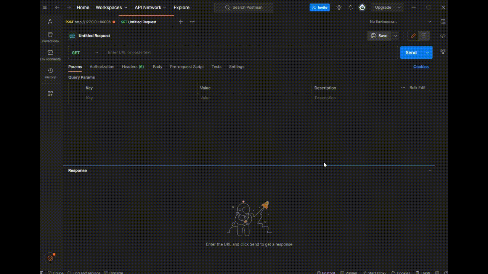
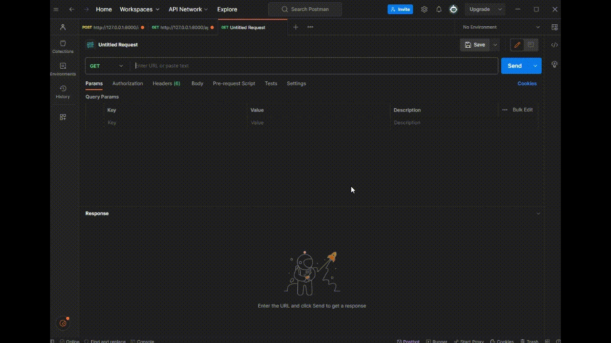
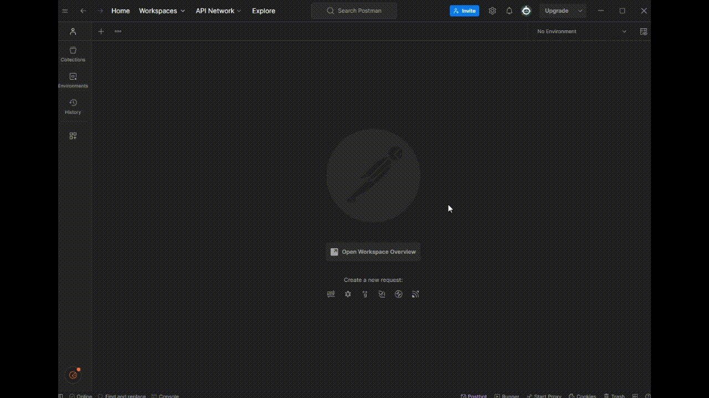
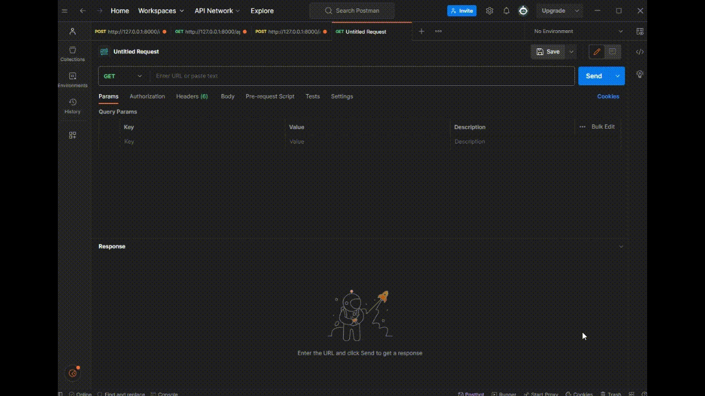

# DRF User Authentication API

## Introduction
This documentation covers the API endpoints for user authentication, which include login, logout, registration, and user data retrieval. These are part of the RESTful services provided by Django Rest Framework and utilize tokens for authentication.

## 1. User Data Retrieval: get_user_data



- Endpoint: http://127.0.0.1:8000/api/user/
- HTTP Method: GET
- Description: Retrieves the information of the authenticated user.
- Response:
  - 200 OK for successful retrieval of user information. Returns user data.
  - 400 Bad Request if the user is not authenticated.
 
```python
@api_view(['GET'])
def get_user_data(request):
    user = request.user

    if user.is_authenticated:
        user_data = {
            'user_info':{
                'id': user.id,
                'username': user.username,
                'email': user.email
            },
        }

        return Response(user_data, status=status.HTTP_200_OK)

    return Response({'error': 'not authenticated'}, status=status.HTTP_400_BAD_REQUEST)
```

## 2. User Registration: register_api



- Endpoint: http://127.0.0.1:8000/api/register/
- HTTP Method: POST
- Description: Registers a new user and returns user information along with the authentication token.
- Parameters: User information (username, email, password).
- Response:
  - Returns the registered user's data along with the authentication token.

```python
@api_view(['POST'])
def register_api(request):
    serializer = RegisterSerializers(data=request.data)
    serializer.is_valid(raise_exception=True)
    user = serializer.save()
    token, _ = Token.objects.get_or_create(user=user)

    user_data = {
        'user_info':{
            'id': user.id,
            'username': user.username,
            'email': user.email
        },
        'token': token.key
    }

    return Response(user_data)
```

## 3. User Login: login_api



- Endpoint: http://127.0.0.1:8000/api/login/
- HTTP Method: POST
- Description: Logs in the user and returns user information along with the authentication token.
- Parameters: User credentials (username, password).
- Response:
  - Returns the authenticated user's data and authentication token.

```python
@api_view(['POST'])
def login_api(request):
    serializer = AuthTokenSerializer(data=request.data)
    serializer.is_valid(raise_exception=True)
    user = serializer.validated_data['user']
    token, _ = Token.objects.get_or_create(user=user)

    user_data = {
        'user_info':{
            'id': user.id,
            'username': user.username,
            'email': user.email
        },
        'token': token.key
    }

    return Response(user_data)
```

## 4. User Logout: logout_api



- Endpoint: http://127.0.0.1:8000/api/logout/
- HTTP Method: POST
- Description: Logs out the authenticated user and deletes the authentication token.
- Permissions: Requires authentication.
- Response:
  - 200 OK for successful logout.

```python
@api_view(['POST'])
@permission_classes([IsAuthenticated])
```

## Import Statements
These functions utilize several import statements from Django Rest Framework, which include decorators, response handling, status codes, authentication models, and serializers.

```python
from rest_framework import status
from rest_framework.decorators import api_view, permission_classes
from rest_framework.response import Response
from rest_framework.authtoken.models import Token
from users.serializers import RegisterSerializers
from rest_framework.permissions import IsAuthenticated
from rest_framework.authtoken.serializers import AuthTokenSerializer
```
